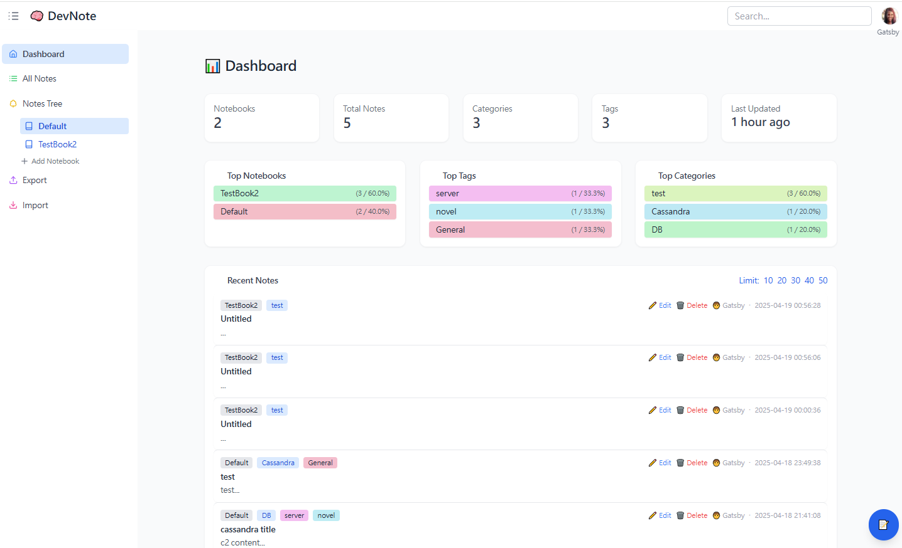

# 🧠 DevNote - Developer Note System

A modern personal knowledge management system for developers.  
Easily write, organize, export and import technical notes using a clean UI.



---

## ✨ Features

- 📝 Rich-text note editing (TinyMCE)
- 🏷️ Tag and category management
- 🔍 Fuzzy search by title, content, and tags
- 📦 Export notes by filter (tags, categories, user IDs)
- 📥 Import and merge external `.db` note files
- 📊 Dashboard with note statistics
- 👤 Per-user login with local avatar support (via `localStorage`)

---

## 🛠️ Tech Stack

- **Frontend**: HTML5, TailwindCSS, JavaScript (vanilla modules)
- **Editor**: TinyMCE
- **Backend**: Python (Flask)
- **Database**: SQLite
- **Module Loader**: SPA-style router.js
- **Storage**: LocalStorage for user meta

---

## 🚀 Getting Started

```bash
# Clone this repository
git clone https://github.com/your-username/devnote.git
cd devnote

python -m pip install {module_name}

open https://github.com/tschoonj/GTK-for-Windows-Runtime-Environment-Installer/releases
to download gtk3-runtime-3.24.31-2022-01-04-ts-win64.exe


# Start Flask backend
python app.py

# Open browser at
http://localhost:5000
